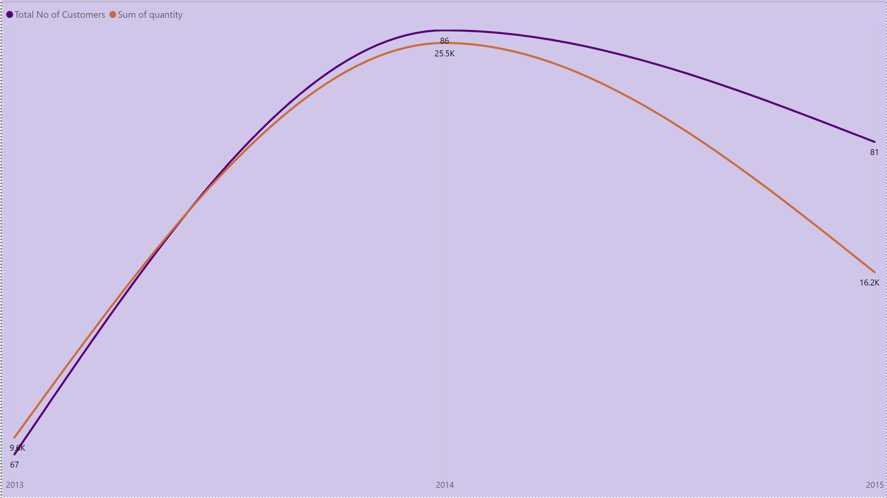

# NORTHWIND-Sales-Analysis-from-2013-to-2015-business-Year

## Introduction

#### The NORTHWIND TRADING STORE is an online customer retail store which has its focus on household consumer products of different brands. It has its customer base from Europe and America with effective shipping methos to move good across both continents. This analysis focuses on monitoring the progress of each department between the year 2013 to 2015.
---
---

## Data sourcing and preparation
#### The data used for this analysis was sourced from the different departments that needed their data to be analyzed. The data has passed through a thorough data preparation process such as cleaning and transformation. The columns with empty cells were ignored since it wasn’t going to be useful in the analysis. The data has been simply visualized for easy understanding.

## Objectives
### The primary PKIs include;
#### 1.	To Determine the Total Number of customers.
#### 2.	To Determine the Total quantity ordered.
#### 3.	To Determine the average unit price of a product.
#### 4.	To Determine the total discount given for all the product purchased.

### The secondary PKIs include;
#### 5.	Breakdown of number of customers by countries, Most used shipping method, Number of items in each category and number of orders process by each employee.
---

---
---
# Observations 

### The above data shows that; 
#### 1. The total number of customers grew from 67 in 2013 to 86 in 2014 and fell to 81 in 2015 with corresponding increase and decreases of quantity of goods ordered.
---

---
#### 2. The total quantity of goods ordered within the three years period is 51,317 items. 
#### 3. The average price of an item is $29 and the total discount given for all purchases amounted to $121
#### 4. The United States of America has the highest number of customers with Ireland, Norway Poland having the lowest customer number of 1 each.
#### 5. Most of the items were shipped using United Package making it the most used shipping method shipping a total of 19,945 items.
#### 6. Confections has the highest number of items in all the categories available.
---
---
# Comments and Recommendations
#### 1. More categories of products should be introduced to the store to give customers more varieties of items to choose from. By so doing, the number of quantities ordered will increase and most likely the store will attract new customers.
#### 2. A promotional email should be sent to existing customers notifying them of the addition of new products to meet their various needs. 
#### 3. Social media campaign should be done to attract new customers to the store.
---
---

